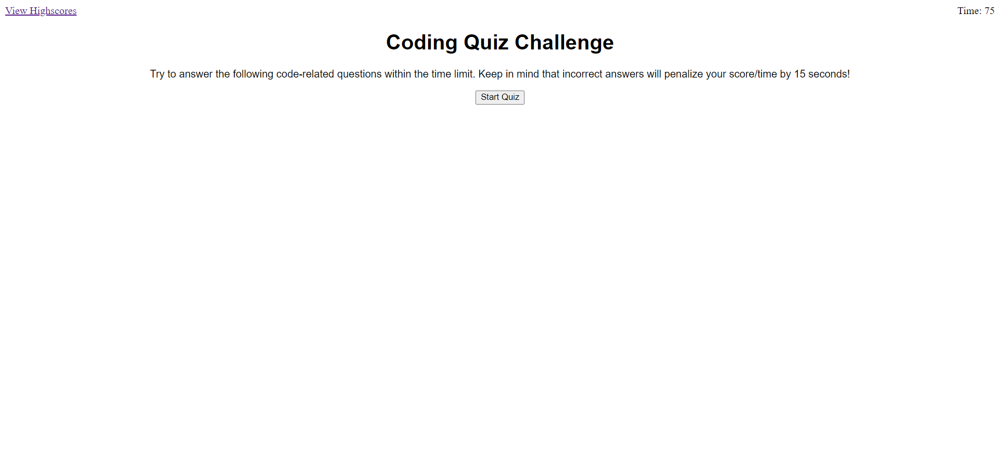

# JavaScript Timed Quiz

## Description

For this week's project, the developer is required to build a timed quiz, featuring multiple choice questions on the topics of coding. This application runs in the browser, and aims to simulate coding assessment that developer is likely to encounter as part of an interview process. In the process of building this application, developer can familiarize themselves with the materials covered in the coursework and learn to apply these skills in real world problems.

You can access the application at https://github.com/Sandy5433/JS-timed-quiz

## Usage

Below is a screenshot of the deployed webpage

Click on the 'Start Quiz' button to commence taking the quiz. The timer will start counting down when the quiz is started. Any wrong answer will deduct 15 seconds from your time so make sure you choose carefully! Quiz will end when you have completed all questions or if you run out of time. Your final score is the amount of time that is remaining at the end of the quiz. Once you have finished the quiz, you can submit your initial, which will take you to the high scores page where you can see how your score compare with will other contestants!.  

## Support

Please reach out to Sandy Hung at sandyhung83@yahoo.com.tw if you have any questions or comments regarding this project. Alternatively, head on to my GitHub at https://github.com/Sandy5433 to see more exciting projects.

## Roadmap

New coding projects will be released every Wednesday night. My first project, refactoring html/css code, can be found on my GitHub.

## Contributing

If you would like to contribute to the development of this timed quiz application, you can reach out to me via the contact details on my portfolio webpage. 

## Authors and acknowledgment

Many thanks to my instructors and tutors from USYD coding bootcamp who stayed back after class to support me on my journey in coding.

## Project status

Completed 8/12/2022
